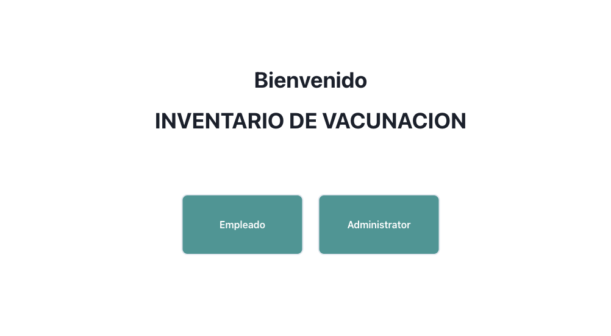
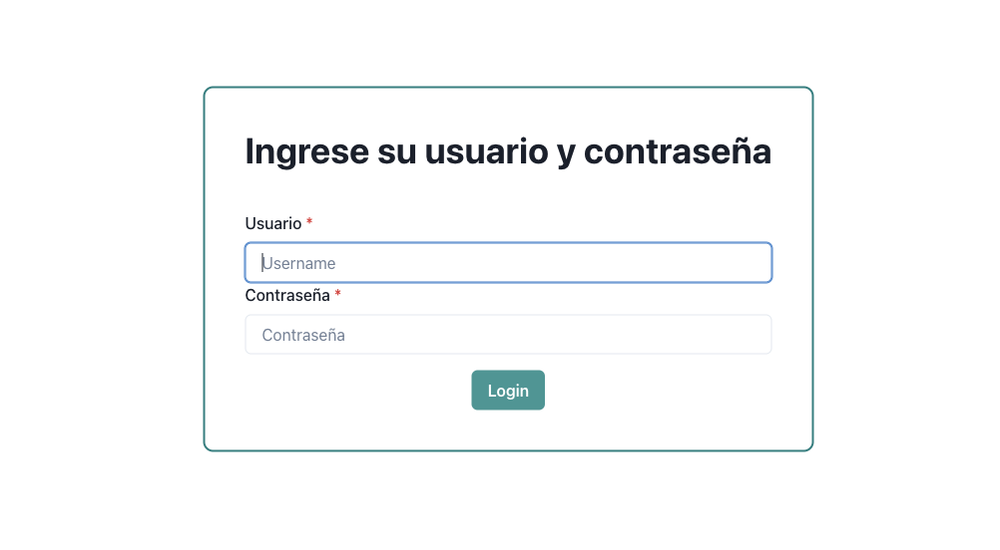
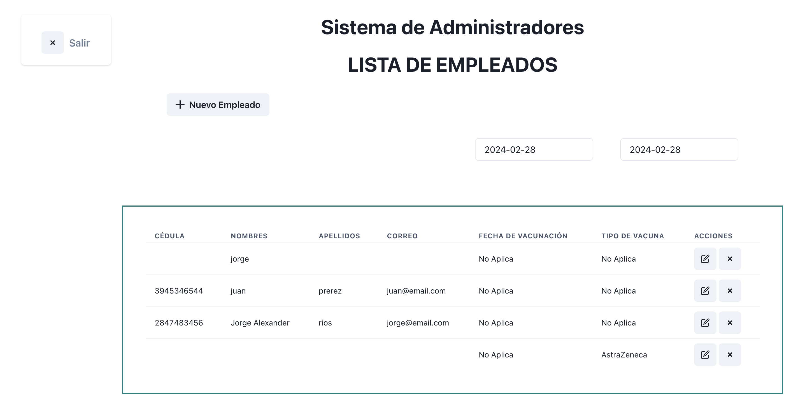
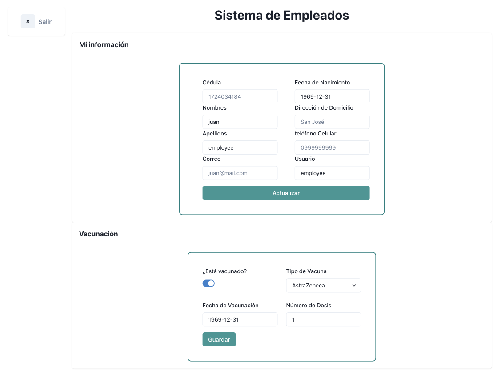
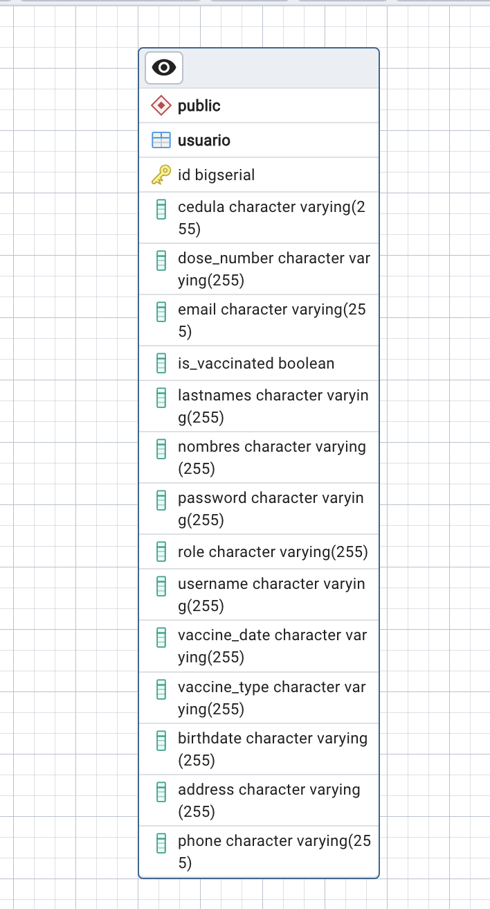

# Kruguer 


# Vacunacion App

> En este proyecto se ha construido una aplicacion web conectando frond y back usando Spring Boot 3 y React para contestar al Reto Kruguer Inventario de vacunación de empleados.


## Screenshots






## Creado con:

- React
- TypeScript
- JavaScript
- HTML
- Chrakra
- Java
- Spring Boot
- Zod
- Postgresql

# Diagrama de base



## Para iniciar el Front-end

Hacer una copia local del repositorio y seguir los siguientes pasos:
1. Abrir el terminal y navegar al folder de l aaplicacion.
2. Ingrese los siguientes comandos en el terminal: 
 ```
 git clone https://github.com/Alexr16/Vacunacion_Front
 ```
 ```
 cd game-app
 ```
 
## Run project

```bash
$ npm install
$ npm run start # this will make webpack watching for your changes in code
```

## Para iniciar el Back-End
Revisar
- Vacunas Back-end [click here](https://github.com/Alexr16/vacunacion_Back).

1. Hacer una copia local del repositorio e ingresar el siguiente comando:
```
mvn clean spring-boot:run
```


## Author

👤 **George**

- GitHub: [@Alexr16](https://github.com/Alexr16)
- Twitter: [@ReveloJ](https://twitter.com/ReveloJ)
- LinkedIn: [Jorge Ríos](https://www.linkedin.com/in/jorgeriosr/)

## 🤝 Contributing

Contributions, issues, and feature requests are welcome!

Feel free to check the [issues page](https://github.com/Alexr16/Vacunacion_Front/issues).

## Show your support

Give a ⭐️ if you like this project!

## Acknowledgments

- Gracias a Kruguer por la oportunidad

## 📝 License

This project is [MIT](./LICENSE) licensed.
